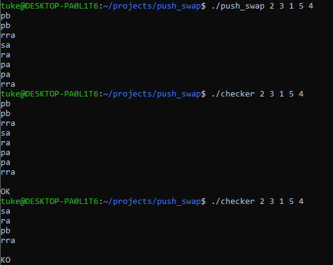

# 42-push_swap
## Task
Idea of this project is to sort numbers in a stack using predefined operations with the help of another stack. Those predefined operations are for example: 
- pb: take the first number on top of stack A and push it on top of stack B.
- ra: shift up all numbers of stack A. First number becomes last.
- rra: shift down all numbers of stack A. Last number becomes first.
- sa: swap the first two numbers of stack A.
- rr, rrr, ss: Do the same operations for both stacks simultaneously.

I have to create two programs: push_swap and checker. Push_swap receives a list of numbers as arguments and then prints out a set of instructions to get the stack sorted.
Checker receives the same list of numbers as arguments, then reads the set of operations from the standard input, runs them, and checks if the stack is indeed sorted.

Goal is to sort the stack with as few operations as possible.

## Constraints
Allowed functions:
- write
- read
- malloc
- free
- exit

## Solution
I created a two-way linked list to be used as a stack. For sorting I created an algorithm inspired by quicksort. To speed up the sorting process I created an AVL tree of the numbers. That gave me a predefined set of chunks to be used in the quicksort algorithm.

## Screenshots

